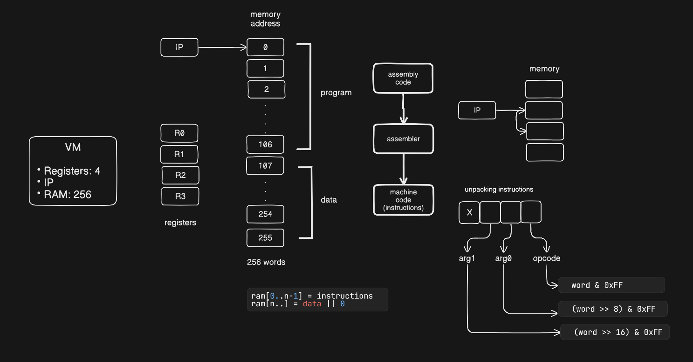

# 🖥️ Virtual Machine

This project implements a Virtual Machine built in Java that realizes the execution of programs at the machine level.

It includes a custom Instruction Set Architecture (ISA) and a two-pass assembler, forming a complete pipeline from
assembly source code to executable machine instructions. The VM simulates core CPU behavior, including memory
management, instruction encoding, branching, and fetch–decode–execute cycle.

## Overview

This VM consists of:

- 4 General Purpose Registers (R0–R3)
- Instruction Pointer (IP)
- RAM size of 256 words (1024 bytes)
- Custom Instruction Set Architecture (ISA)
- Two-pass Assembler
- Static `.data` memory allocation

## Architecture Design



## Instruction Set

### Data Movement

| Instruction    | Description                                     |
|----------------|-------------------------------------------------|
| `ldc Rn value` | Load constant value into register `Rn`          |
| `ldr Rn Rm`    | Load into `Rn` from memory address in `Rm`      |
| `str Rn Rm`    | Store value of `Rn` into memory address in `Rm` |
| `cpy Rn Rm`    | Copy value from `Rm` into `Rn`                  |

### Arithmetic

| Instruction | Description        |
|-------------|--------------------|
| `add Rn Rm` | Add registers      |
| `sub Rn Rm` | Subtract registers |

### Control Flow

| Instruction     | Description                |
|-----------------|----------------------------|
| `je Rn @label`  | Jump to label if `Rn == 0` |
| `jne Rn @label` | Jump to label if `Rn != 0` |
| `hlt`           | Halt execution             |

### I/O

| Instruction | Description                               |
|-------------|-------------------------------------------|
| `prr Rn`    | Print register value                      |
| `prm Rn`    | Print memory value at address in register |
| `prc Rn`    | Print register value as ASCII character   |

## Execution Flow

1. Write the program in the custom assembly language
2. The assembler then:
    - Cleans and parses the program
    - Resolves labels
    - Allocates `.data` memory
    - Encodes instructions into machine code

3. Machine code is loaded into RAM
4. The VM repeatedly reads the next instruction from memory, decodes its opcode and operands, and executes the
   corresponding operation until it encounters a halt instruction

## How to Run

To write and execute your own programs on this VM:

1. **Write Assembly Code**: Create a new `.asm` file in the `src/main/resources/test` folder
2. **Configure the Main Class**: Open `src/main/java/com/aarush/vm/main/Main.java`
3. **Update Filename**: Change the `asmFileName` variable to match your file name (without the `.asm` extension).
   ```java
   String asmFileName = "your_file_name";
4. **Run**: Execute the Main.main() method. The assembler will generate a .o object file in the `output` directory, and
   the VM will execute the
   machine code automatically.

## Acknowledgement

This project was reimplemented in Java and extended from the architectural concepts explained
in  [Software Design by Example](https://third-bit.com/sdxjs/) by Greg Wilson.